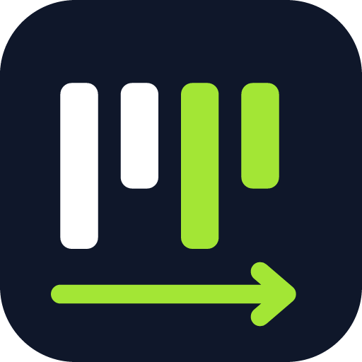
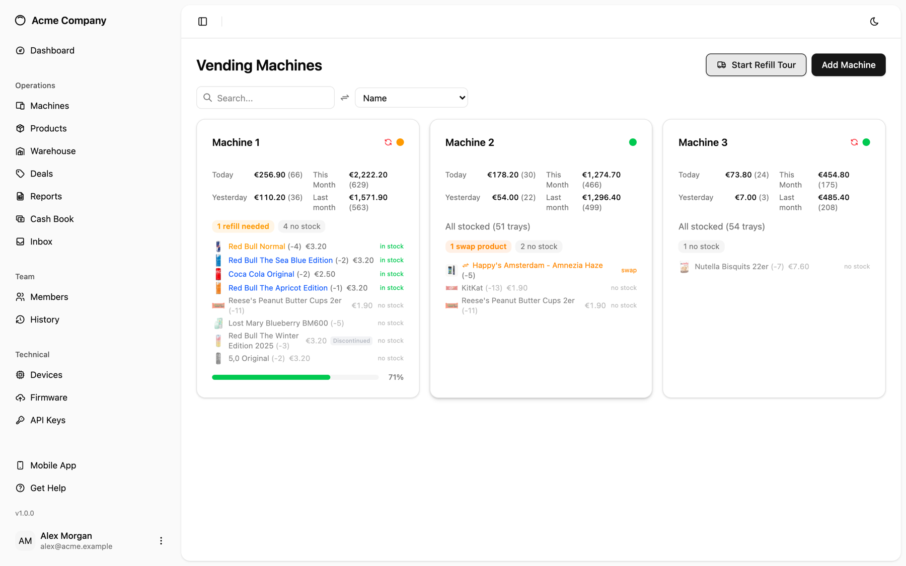
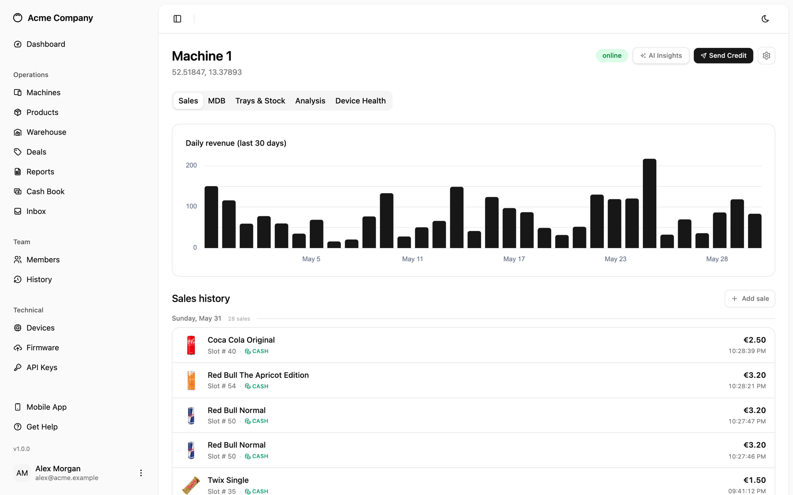
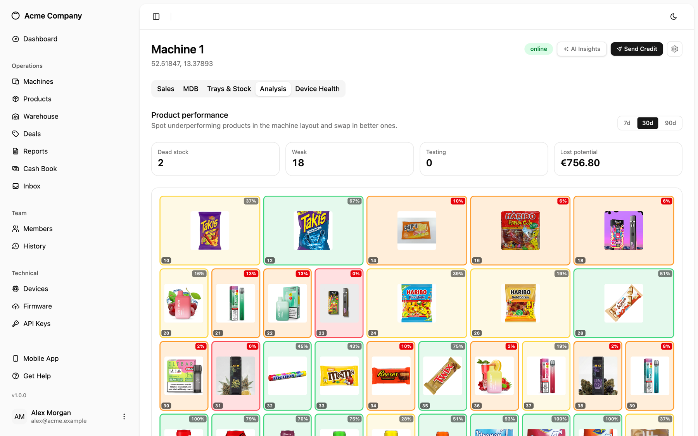
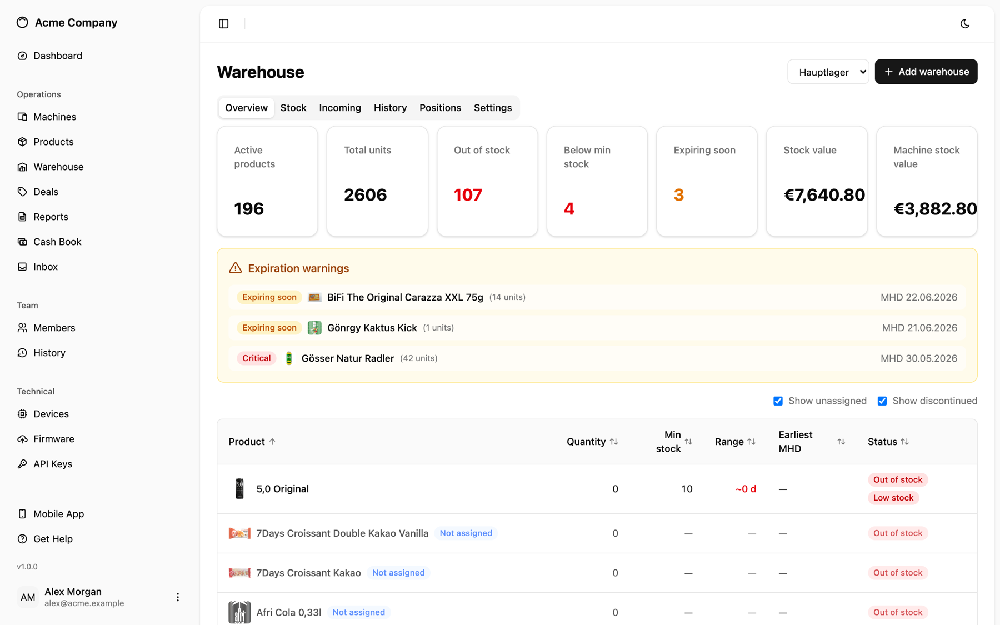
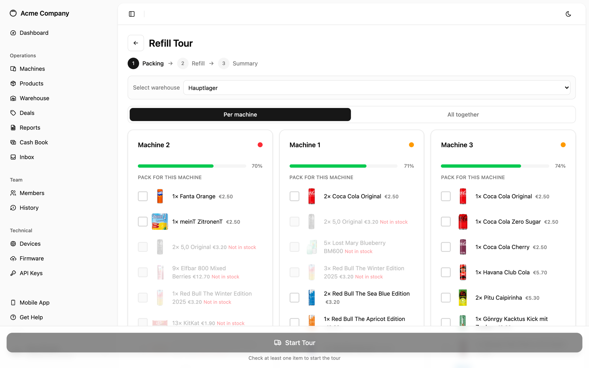
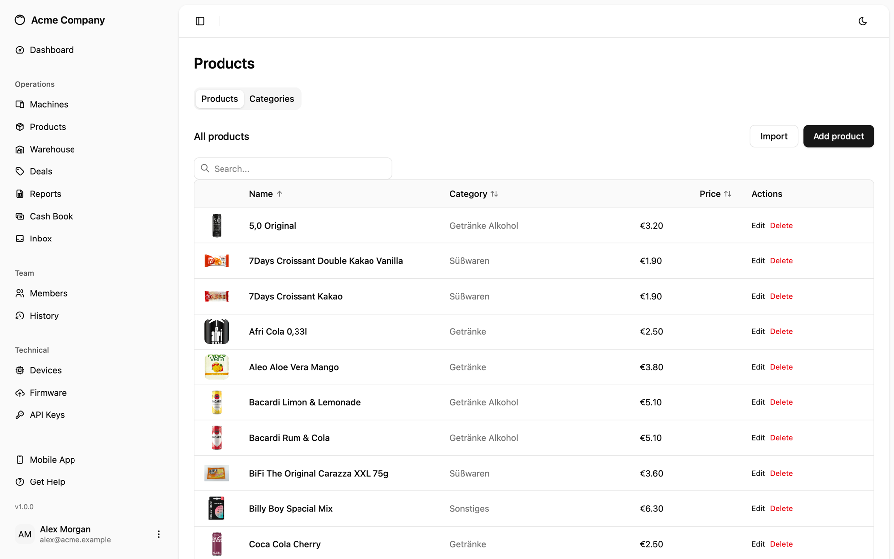
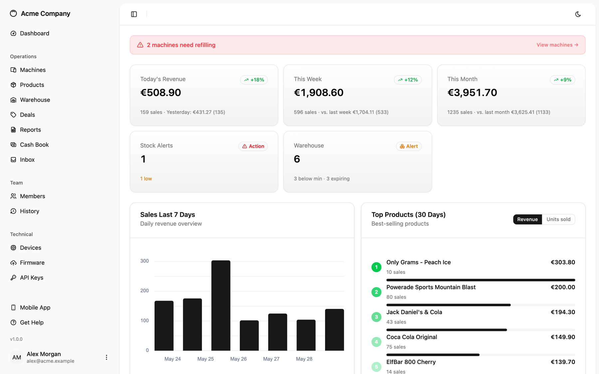
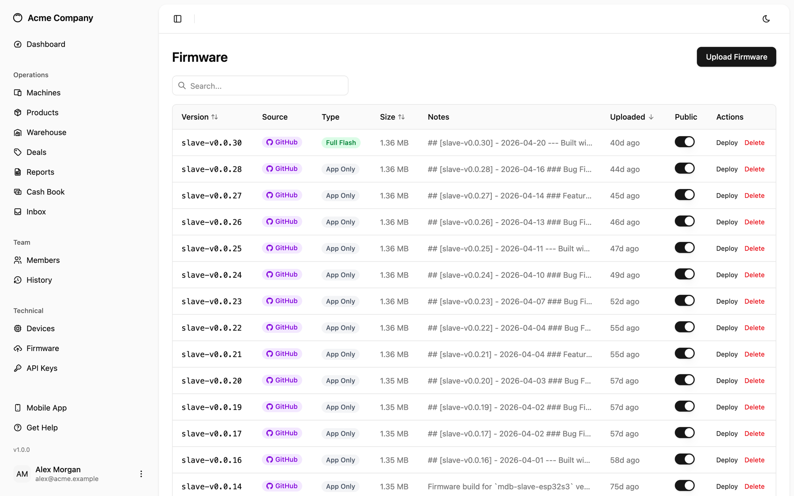

<div align="center">



# VMflow

### Open-Source Vending Machine IoT Platform

**Turn any vending machine into a connected, cashless, remotely managed device.**

[](LICENSE)
[](https://docs.espressif.com/projects/esp-idf/)
[](https://nuxt.com)
[](https://supabase.com)
[](ios/)
[](#-contributing)

**[🌐 Live Dashboard](https://app.kerl-handel.de)** · [⚡ Web Installer](https://app.kerl-handel.de/install) · [📖 Local Dev](DEV.md) · [🚀 Production](PROD.md) · [🏗 Architecture](ARCHITECTURE.md)

</div>

---

VMflow is a complete, **self-hostable** platform for retrofitting ordinary vending machines with modern IoT capabilities. A custom **ESP32-S3** board plugs into any machine's **MDB (Multi-Drop Bus)** and instantly unlocks cashless payments, real-time sales tracking, remote credit delivery, over-the-air firmware updates, warehouse-driven refills, foot-traffic analytics, and AI-powered insights — all controlled from a modern web dashboard and a native iOS app.

No vendor lock-in, no cloud subscription, no per-device fees. You own the hardware, the firmware, the backend, and the data.

---

## ✨ What You Can Do

<table>
<tr>
<td width="50%" valign="top">

### 🏪 Fleet & Machine Management
Monitor every machine in real time — online/offline status, today/this-week/this-month revenue, sales counts, and which machines need refilling. Drill into any machine for a 30-day revenue chart and an itemized, time-stamped sales history.

</td>
<td width="50%" valign="top">

### 💳 Cashless Payments (MDB)
A standards-compliant MDB **cashless peripheral**. Deliver credit to a machine remotely over MQTT or BLE, sit alongside existing coin/bill acceptors, and approve vends in real time. All payloads are XOR-encrypted with replay protection.

</td>
</tr>
<tr>
<td width="50%" valign="top">

### 📦 Warehouse & Inventory
Barcode-driven stock intake, **FIFO batch tracking** with expiry dates, per-warehouse minimum-stock alerts, stock-value reporting, and physical position layouts. Stock auto-decrements on every sale.

</td>
<td width="50%" valign="top">

### 🔁 Guided Refill Tours
A step-by-step refill wizard generates per-machine packing lists from live warehouse stock, walks the operator through the route, deducts inventory FIFO, and logs the whole tour for history and audit.

</td>
</tr>
<tr>
<td width="50%" valign="top">

### 🤖 AI Insights
Per-machine and fleet-wide recommendations powered by the **Claude API** — spot dead slots, surface best-sellers, and get concrete product-swap suggestions, in your own language. Bring your own API key.

</td>
<td width="50%" valign="top">

### 🧾 Sales Reconciliation
Upload a **Nayax** sales export and reconcile it against recorded sales with a time-tolerant matcher. Bulk-import anything missing, remove ghost entries, and export a CSV diff — fully audited.

</td>
</tr>
<tr>
<td width="50%" valign="top">

### 📊 Telemetry & Foot Traffic
Read **EVA-DTS DEX/DDCMP** data straight off the machine, count nearby foot traffic with the **PAX Counter** (anonymized BLE/WiFi presence), and keep a full MDB bus diagnostics + state history per device.

</td>
<td width="50%" valign="top">

### 🔄 OTA & Firmware
Build firmware in **GitHub Actions**, import a release with one click, and deploy **over-the-air** to any device over MQTT. Full/app-only images, version notes, and per-version rollout control.

</td>
</tr>
<tr>
<td width="50%" valign="top">

### 📡 Resilient Connectivity
WiFi out of the box, with optional **Cellular / LTE** (SIM7080G Cat-M / NB-IoT) for machines without a network. A multi-layer recovery ladder keeps devices online unattended in the field.

</td>
<td width="50%" valign="top">

### 🏢 Multi-Tenancy & Security
Organization-based access with **admin/viewer** roles, email invitations, and **row-level security** on every table. Self-hosted auth, storage, and database — your data never leaves your server.

</td>
</tr>
</table>

---

## 🖥 Management Dashboard

A modern, responsive web app (Nuxt 4 PWA, installable, dark mode, English & German) that gives operators full control over their fleet.

> **[👉 See it live at app.kerl-handel.de](https://app.kerl-handel.de)**

<table>
<tr>
<td width="50%" align="center" valign="top">



**Fleet overview** — live status, per-machine revenue, and stock urgency at a glance

</td>
<td width="50%" align="center" valign="top">



**Machine detail** — 30-day revenue chart and itemized sales history with product images

</td>
</tr>
<tr>
<td width="50%" align="center" valign="top">



**Product analysis** — springboard layout colour-coded by performance, with one-click swaps

</td>
<td width="50%" align="center" valign="top">



**Warehouse** — stock levels, FIFO batches, expiry warnings, and live stock value

</td>
</tr>
<tr>
<td width="50%" align="center" valign="top">



**Guided refill tour** — per-machine packing lists driven by live warehouse availability

</td>
<td width="50%" align="center" valign="top">



**Product catalog** — images, categories, pricing, and bulk Nayax import

</td>
</tr>
<tr>
<td width="50%" align="center" valign="top">



**Dashboard** — revenue KPIs, 7-day trend, and best-selling products

</td>
<td width="50%" align="center" valign="top">



**Firmware & OTA** — import from GitHub releases and deploy over-the-air

</td>
</tr>
</table>

---

## 📱 iOS App

A native **SwiftUI** app for operators — full fleet management from your pocket.

- **Dashboard** — revenue KPIs, 30-day sales chart, recent-sales feed
- **Machines** — sorted by stock urgency, with warehouse-availability labels
- **Trays & Stock** — per-machine slot configuration and quick stock adjustments
- **Refill Wizard** — warehouse-aware packing, guided refill tour, and a review step
- **Sales Stats** — today / yesterday / this week / last week per machine

Built with SwiftUI, Swift Concurrency, the Supabase Swift SDK, and Swift Charts. See [`ios/README.md`](ios/README.md) for setup.

<!--
  📸 iOS SCREENSHOTS
  Drop device screenshots into docs/screenshots/ios/ and uncomment the gallery below.

<table>
<tr>
<td width="33%" align="center"><br/><b>Dashboard</b></td>
<td width="33%" align="center"><br/><b>Machines</b></td>
<td width="33%" align="center"><br/><b>Refill Wizard</b></td>
</tr>
</table>
-->

> 📲 _App screenshots are being added — coming soon._

---

## 🤖 Android App

A native Android app is on the roadmap. **Coming soon.**

---

## 🔌 Hardware

The custom PCB connects directly to the vending machine's MDB bus via the standard connector. It's powered from the machine's own supply, needs no external power, and talks to the backend over WiFi (or optional Cellular/LTE) + MQTT.

<table>
<tr>
<td width="33%" align="center" valign="top">


**PCB v3** — latest revision

</td>
<td width="33%" align="center" valign="top">


**Installed** — with 3D-printed mount

</td>
<td width="33%" align="center" valign="top">


**Mounting bracket** — printable STL included

</td>
</tr>
</table>

**Key specs**

- **MCU:** ESP32-S3 (dual-core, WiFi + BLE 5)
- **MDB interface:** UART 9600 baud, 9-bit mode, optocoupler isolated
- **Power:** drawn from the vending-machine bus (onboard buck converter)
- **Connectivity:** WiFi, optional Cellular/LTE (SIM7080G Cat-M / NB-IoT)
- **Connectors:** MDB, USB-C (programming & debug), DEX telemetry port
- **PCB design:** KiCad — sources in [`kicad/`](kicad/)
- **Enclosure:** 3D-printable bracket — STL/STEP in [`3d-printing/`](3d-printing/)

> 🛒 **Order the PCB:** [PCBWay shared project](https://www.pcbway.com/project/shareproject/mdb_esp32_cashless_bc6bf8d8.html)

---

## 🏗 How It Works

```
┌───────────────────────────────────────────────────────────────────┐
│                       Management UI (Nuxt 4)  ·  iOS App (SwiftUI)  │
│            Dashboard · Machines · Warehouse · Refill · Firmware     │
└──────────────────────────────┬────────────────────────────────────┘
                               │ HTTPS
                               ▼
┌─────────────────────────────────────────────────────────────────────┐
│                       Supabase (self-hosted)                          │
│   ┌──────────┐  ┌──────────┐  ┌────────────────┐  ┌───────────────┐  │
│   │  Kong    │  │  Auth    │  │ Edge Functions  │  │   Storage     │  │
│   │ API GW   │  │ (GoTrue) │  │     (Deno)      │  │ firmware/imgs │  │
│   └──────────┘  └──────────┘  └────────┬────────┘  └───────────────┘  │
│   ┌─────────────────────────────────────────────────────────────┐    │
│   │            PostgreSQL  (RLS + multi-tenancy)                 │    │
│   └─────────────────────────────────────────────────────────────┘    │
└──────────────────────────────┬────────────────────────────────────────┘
                               │
            ┌──────────────────┼──────────────────┐
            ▼                  ▼                  ▼
┌──────────────────┐  ┌──────────────┐  ┌──────────────────────┐
│  MQTT Forwarder  │  │ MQTT Broker  │  │   GitHub Actions     │
│     (Deno)       │  │ (Mosquitto)  │  │   CI/CD → Releases   │
│  MQTT → Webhook  │  │    :1883     │  │   (firmware builds)  │
└──────────────────┘  └──────┬───────┘  └──────────────────────┘
                             │  MQTT over WiFi / Cellular
              ┌──────────────┴──────────────┐
              ▼                             ▼
   ┌──────────────────────┐     ┌──────────────────────┐
   │   ESP32-S3 (Slave)   │     │   ESP32-S3 (Slave)   │
   │   MDB Cashless       │ ··· │   MDB Cashless       │
   │  ┌────────────────┐  │     │  ┌────────────────┐  │
   │  │ Vending Machine│  │     │  │ Vending Machine│  │
   │  └────────────────┘  │     │  └────────────────┘  │
   └──────────────────────┘     └──────────────────────┘
```

Devices publish sales, status, telemetry, and diagnostics to per-tenant MQTT topics (`/{company}/{device}/{event}`). A Deno forwarder bridges MQTT to a Supabase Edge Function that decrypts, validates, and writes to PostgreSQL. Sensitive payloads (credit, sales, config) are **XOR-encrypted** with an 18-byte passkey and an ±8-second timestamp window to prevent replay. See [ARCHITECTURE.md](ARCHITECTURE.md) for the full picture.

---

## 🚀 Getting Started

### 1. Flash the firmware

The easiest way — no build tools required:

👉 **[app.kerl-handel.de/install](https://app.kerl-handel.de/install)** — flash directly from your browser via Web Serial

Or build from source with ESP-IDF v5.x:

```bash
cd mdb-slave-esp32s3
. $IDF_PATH/export.sh
idf.py build flash monitor
```

### 2. Deploy the platform

Pick the setup that fits your use case:

| | **Local Development** | **Production** |
|---|---|---|
| **Guide** | 📖 [**DEV.md**](DEV.md) | 🚀 [**PROD.md**](PROD.md) |
| **Purpose** | Develop & test locally | Deploy for real devices |
| **Backend** | Supabase CLI (`supabase start`) | Docker Compose (`docker compose up`) |
| **Frontend** | `npm run dev` (hot reload) | Built & served via Docker |
| **Setup** | `supabase start` + `npm run dev` | `bash setup.sh` (one command) |

### 3. Provision a device

Once the platform is running:

1. Power on the ESP32 board → it creates a WiFi hotspot
2. Connect to the hotspot and open the captive portal → enter WiFi credentials + server URL
3. In the dashboard, go to **Devices** → generate a provisioning code
4. Enter the code on the device's captive portal
5. The device reboots, connects to MQTT, and appears in your dashboard

---

## 🔗 REST API

VMflow exposes a full REST API via Supabase. Authenticate with a JWT bearer token.

<details>
<summary><strong>Get a bearer token</strong></summary>

```bash
curl -X POST 'https://your-server:8000/auth/v1/token?grant_type=password' \
  -H "apikey: YOUR_ANON_KEY" \
  -H "Content-Type: application/json" \
  -d '{ "email": "you@example.com", "password": "your_password" }'
```
</details>

<details>
<summary><strong>Send credit to a machine</strong></summary>

```bash
curl -X POST 'https://your-server:8000/functions/v1/send-credit' \
  -H "apikey: YOUR_ANON_KEY" \
  -H "Authorization: Bearer YOUR_ACCESS_TOKEN" \
  -H "Content-Type: application/json" \
  -d '{ "subdomain": 51, "amount": 1.50 }'
```
</details>

<details>
<summary><strong>View sales</strong></summary>

```bash
curl -X GET 'https://your-server:8000/rest/v1/sales' \
  -H "apikey: YOUR_ANON_KEY" \
  -H "Authorization: Bearer YOUR_ACCESS_TOKEN"
```
</details>

<details>
<summary><strong>View devices</strong></summary>

```bash
curl -X GET 'https://your-server:8000/rest/v1/embeddeds' \
  -H "apikey: YOUR_ANON_KEY" \
  -H "Authorization: Bearer YOUR_ACCESS_TOKEN"
```
</details>

---

## 🗺 PAX Counter — Foot-Traffic Heatmap

Each device scans for nearby BLE/WiFi devices and reports anonymized presence counts, visualized as heatmaps for location-performance analysis.


---

## 📂 Project Structure

```
mdb-esp32-cashless/
├── mdb-slave-esp32s3/       # ESP32 firmware — MDB cashless peripheral
├── mdb-master-esp32s3/      # ESP32 firmware — VMC simulator (for testing)
├── management-frontend/     # Nuxt 4 management dashboard (PWA)
├── ios/                     # Native iOS app (SwiftUI)
├── Docker/                  # Self-hosted backend (docker-compose)
│   ├── supabase/            # Edge functions, migrations, config
│   ├── mqtt/                # Mosquitto broker + Deno forwarder
│   └── setup.sh             # One-command production setup
├── kicad/                   # PCB design files (KiCad)
├── 3d-printing/             # Mounting bracket (STL/STEP/F3D)
├── docs/                    # Screenshots & documentation assets
├── .github/workflows/       # CI/CD — automated firmware builds
├── DEV.md                   # Local development guide
├── PROD.md                  # Production deployment guide
└── ARCHITECTURE.md          # System architecture details
```

---

## 🧰 Tech Stack

| Layer | Technology |
|-------|-----------|
| **Firmware** | ESP-IDF v5.x, FreeRTOS, NimBLE, MQTT, SIM7080G (cellular) |
| **Backend** | Supabase (PostgreSQL, GoTrue, PostgREST, Kong, Edge Functions) |
| **Edge Functions** | Deno (TypeScript) |
| **Frontend** | Nuxt 4, TypeScript, shadcn-vue, TailwindCSS 4, PWA, i18n (en/de) |
| **MQTT** | Eclipse Mosquitto + custom Deno forwarder |
| **AI** | Claude API (machine & fleet insights) |
| **PCB** | KiCad |
| **CI/CD** | GitHub Actions (ESP-IDF builds → GitHub Releases) |
| **iOS App** | SwiftUI, Swift Concurrency, Supabase Swift SDK, Swift Charts |

---

## 🤝 Contributing

Contributions are welcome — firmware, dashboard features, PCB revisions, docs, or bug fixes.

1. **Fork** the repository
2. Set up your [local development environment](DEV.md)
3. Create a feature branch (`git checkout -b feature/my-feature`)
4. Make your changes and ensure the build passes
5. Open a Pull Request

---

## 🙏 Acknowledgments

VMflow began as a fork of **[nodestark/mdb-esp32-cashless](https://github.com/nodestark/mdb-esp32-cashless)**.

Huge thanks to **[@nodestark](https://github.com/nodestark)** for the original open-source MDB cashless implementation for the ESP32 — the protocol foundation that everything here is built on. This project would not exist without that work. 🙌

---

## 📄 License

Licensed under the **MIT License** — see [LICENSE](LICENSE).

Original work Copyright © 2025 Nodestark. VMflow additions © 2025–2026 the VMflow contributors.
