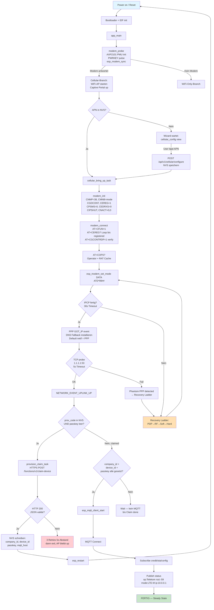
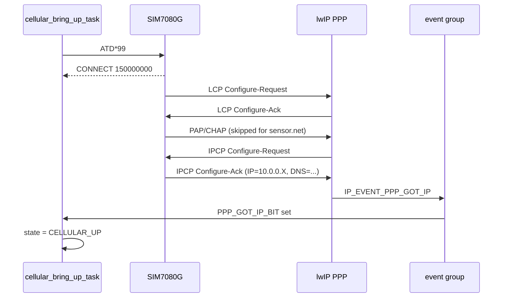
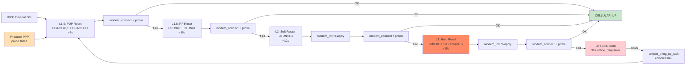
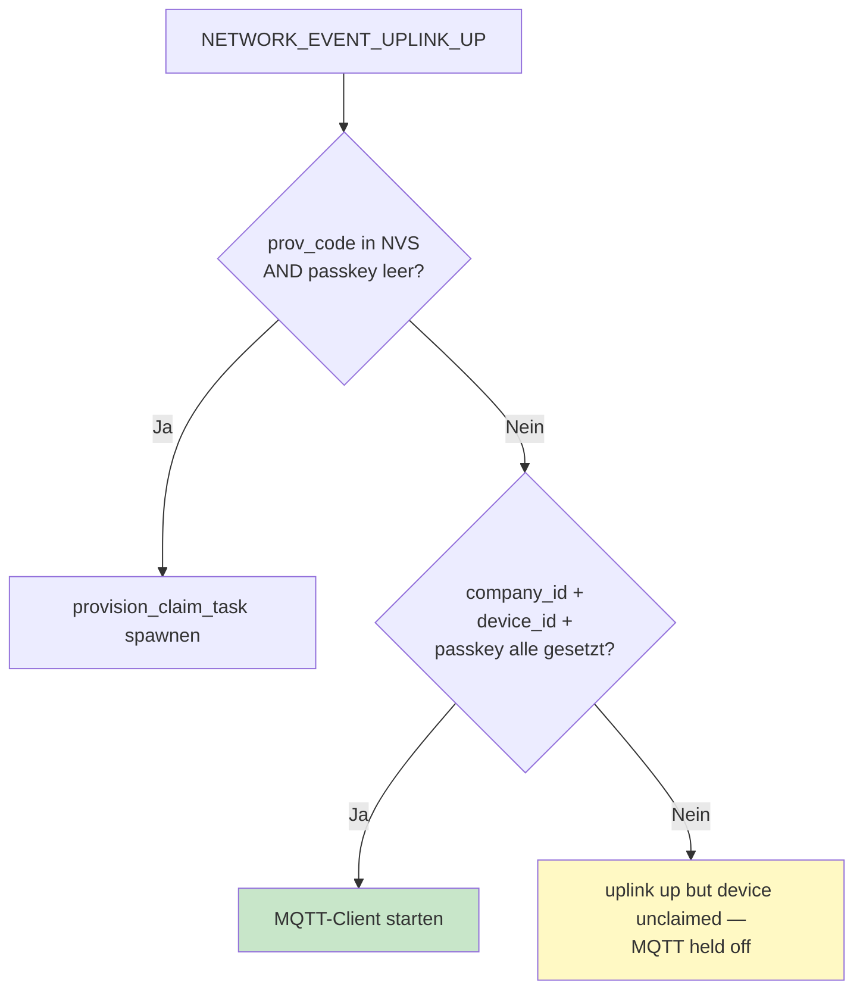
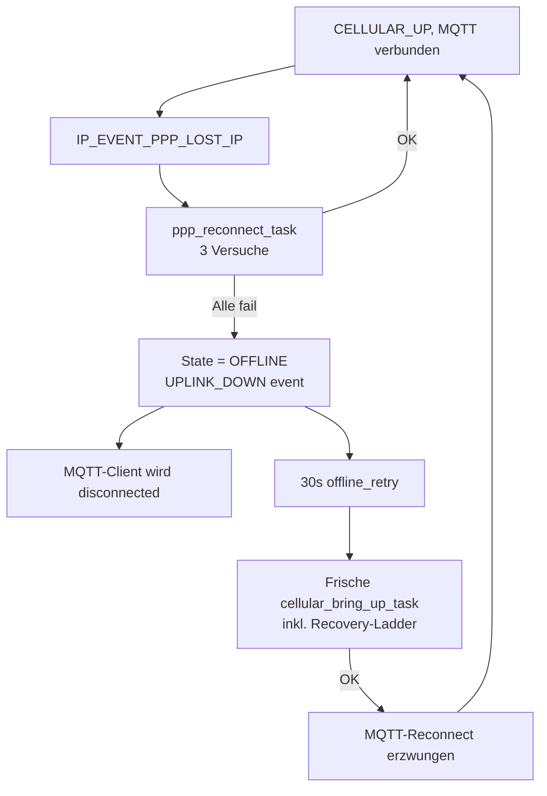

# Cellular Bring-Up & Provisioning Flow

End-to-end walkthrough: **frisch geflashtes Gerät** → **online, claimed, MQTT verbunden**.

Zielgruppe: Field-Techniker, Onboarding, Debugging. Voraussetzung: minimal C / Netzwerk-Verständnis.

---

## Übersicht — Happy Path



---

## Stufen im Detail

### Stufe 1: Power-On + Modem-Probe (~0–10s)

**Was passiert physisch:**

1. ESP32-S3 startet, Bootloader → app_main
2. `modem_probe()` versucht das Modem zu erreichen:
   - **AXP2101 PMU init** über I2C (SDA=15, SCL=7, Slave 0x34)
     - DC3 enable @ 3000mV → Hauptstrom für SIM7080G
     - BLDO1 enable @ 3300mV → Level-Conversion
   - **PWRKEY pulse** (1.2s low) → Modem bootet
   - **`esp_modem_sync`** → AT-Test, antwortet das Modem?

**Branch-Entscheidung:**

| Modem antwortet? | Pfad |
|---|---|
| Ja | Cellular-Branch — WiFi-STA wird **nicht** initialisiert |
| Nein | WiFi-Only-Branch — STA + AP-Modus |

**Logs:**
```
I modem: PMU: AXP2101 detected (chip ID 0x4A)
I modem: PMU: DC3 enabled at 3000 mV (modem main power)
I modem: PMU: BLDO1 enabled at 3300 mV (level conversion)
I modem: esp_modem_sync (cold try): ESP_OK
I modem: modem detected and synced
```

---

### Stufe 2: Captive Portal AP startet (~10s nach Boot)

Auf Cellular-Boards kommt der SoftAP **immer** hoch — auch wenn alles funktioniert. Dadurch ist das Gerät jederzeit konfigurierbar ohne USB-Kabel.

- SSID: `VMflow`
- Passwort: hardcoded (siehe `webui_server.c::AP_PASS`)
- IP-Range: 192.168.4.0/24, AP selbst auf 192.168.4.1
- DNS-Hijack: alle Anfragen → 192.168.4.1 (für Captive-Portal-Erkennung)
- HTTP-Server hört auf Port 80

**APN-Check in NVS:**

| `apn` Key in NVS? | Aktion |
|---|---|
| Ja | `cellular_bring_up_task` startet sofort im Hintergrund |
| Nein | Wizard zeigt `cellular_config`-View, User muss APN+PIN+LTE-Mode eintragen |

---

### Stufe 3: User tippt APN ein (nur Erst-Setup)

Wenn `apn` noch nicht in NVS:

1. User verbindet Phone mit `VMflow` WLAN
2. iOS/Android öffnet Captive Portal automatisch (oder User tippt http://192.168.4.1)
3. Wizard zeigt Form: APN + optional SIM-PIN + LTE-Mode (Auto / LTE-M / NB-IoT)
4. POST `/api/v1/cellular/configure` → speichert NVS-Keys `apn`, `sim_pin`, `lte_mode`
5. `network_cellular_configure()` spawnt `cellular_bring_up_task`

---

### Stufe 4: cellular_bring_up_task (~10–60s)

**modem_init** — schickt SIM7080G-Konfiguration im COMMAND-Mode:

| AT Command | Zweck |
|---|---|
| `AT+CNMP=38` | Network mode: LTE only (kein GSM-Fallback) |
| `AT+CMNB=N` | LTE sub-mode: 1=Cat-M, 2=NB-IoT, 3=Auto |
| `AT+CGDCONT=1,"IP","<apn>"` | PDP-Context anlegen |
| `AT+CEREG=1` | EPS-Registration URC enabled |
| `AT+CPSMS=0` | Power-Save-Mode AUS (sonst Carrier-NAT-Drops) |
| `AT+CEDRXS=0,4` | eDRX AUS für Cat-M |
| `AT+CEDRXS=0,5` | eDRX AUS für NB-IoT |
| `AT+CIPSHUT` | Internen TCP/IP-Stack-Residue räumen (Phantom-PPP-Schutz) |
| `AT+CNACT=0,0` | App-PDP deaktivieren falls alt-aktiv (Phantom-PPP-Schutz) |

**Wichtig — kein `AT+CGACT=1,1`:** Auf LTE/Cat-M aktiviert sich der Default-Bearer (CID 1) **automatisch** mit der Registration. Manuell `AT+CGACT=1,1` triggert einen Race der die PDP-Context-Bindung splittet — inbound funktioniert, outbound droppen am GTP-Layer. Genau das Phantom-PPP-Symptom. Niemals manuell aktivieren.

**modem_connect** — Funk-Aktivierung:

| Schritt | Action | Timeout |
|---|---|---|
| 1 | `AT+CFUN=1` (RF on) | 30s |
| 2 | `AT+CEREG?` Loop bis `stat=1` (home) oder `5` (roaming) | 30 × 2s = 60s |
| 3 | `AT+CGCONTRDP=1` Verify-Loop (5×) — bestätigt PDP wirklich aktiv | 5 × 1s = 5s |
| 4 | `AT+COPS?` → Operator-Name + RAT (7=LTE-M, 9=NB-IoT) | 2s |
| 5 | `esp_modem_set_mode(DATA)` → ATD*99## intern | sofort |

**Warum `AT+CGCONTRDP` Verify:** Nach `+CEREG: 1,5` (registered) kann es 1-5s dauern bis die Carrier-seitige Data-Attach wirklich komplett ist. Wenn wir zu früh in DATA-Mode gehen, bekommen wir ATD `CONNECT` aber ohne echten GTP-Tunnel. CGCONTRDP gibt die echten dynamischen Parameter (IP, DNS, Gateway) zurück — leer = noch nicht aktiv, voll = wirklich da.

**Logs für Erfolg:**
```
I modem: PSM + eDRX disabled (IoT power-save off)
I modem: internal TCPIP stack cleared
I modem: AT+CFUN=1: ESP_OK
I modem: EPS registered: +CEREG: 1,5
I modem: PDP context active: +CGCONTRDP: 1,5,"sensor.net","100.x.x.x"...
I modem: AT+COPS?: +COPS: 0,0,"Telekom.de",7
I modem: registered on RAT 7 → LTE-M
I modem: set DATA mode: ESP_OK
```

---

### Stufe 5: PPP IPCP (~2–30s nach DATA mode)

**Kritischer Schritt:** `set_mode(DATA)` returnt **bevor** PPP fertig ist. Wir warten explizit auf `IP_EVENT_PPP_GOT_IP`.



**DNS-Fallback:** Wenn der Carrier keine DNS-Server pusht (z.B. `sensor.net`), installiert der Handler 8.8.8.8 + 1.1.1.1 manuell. Sonst würde jeder `getaddrinfo()` mit `EAI_NONAME` scheitern.

**Default netif:** PPP wird explizit als Default gesetzt (statt es lwIP überlassen). Verhindert dass Outbound-Traffic über den AP statt PPP routet.

**Note: `10.0.0.1` im Log ist normal.** Das ist der von SIMCom-Modems hardcoded IPCP-peer placeholder, **kein** Indikator für einen halb-kaputten State. Die echte vom Carrier vergebene IP läuft auf dem PPP netif (CGNAT-Range, typischerweise `100.64.x.x` oder ähnlich).

---

### Stufe 5b: Reachability-Probe (~5s)

**Phantom-PPP-Schutz:** PPP IPCP kann erfolgreich sein während der eigentliche Datenpfad gar nicht funktioniert (PDP-Context split-bound, internal TCPIP-Stack-Residue, Carrier-Side-Glitch). Bevor wir `UPLINK_UP` feuern, machen wir einen **echten** End-to-End-Test:

```
TCP connect 1.1.1.1:53 mit 5s Timeout
  → SYN-ACK kommt zurück → echtes Internet ✓
  → keine Antwort       → Phantom-PPP, Recovery-Ladder triggert
```

**Warum `1.1.1.1:53`:**
- Anycast (extrem niedrige RTT von überall)
- Nie geblockt (manche Corporate-/Carrier-Filter blocken HTTP-Probes auf 80/443, DNS-Port 53 fast nie)
- SYN-ACK bestätigt **bidirektionalen** TCP — Phantom-PPP würde hier scheitern

**Logs für Erfolg:**
```
I network: PPP GOT_IP: 10.0.0.1
I network: PPP DNS: main=8.8.8.8 backup=8.8.4.4
I network: IPCP completed after initial connect — probing internet
I network: internet reachable after initial connect
I network: cellular up
```

**Logs bei Phantom-PPP:**
```
I network: PPP GOT_IP: 10.0.0.1
I network: IPCP completed after initial connect — probing internet
W network: internet probe failed after initial connect (phantom PPP) — escalating
I network: PPP attempt: PDP reset
W modem: L1.5 recovery: AT+CGACT=0,1
... Recovery-Ladder durchlaufen ...
```

---

### Stufe 6: Was bei IPCP-Fehler oder Phantom-PPP passiert (Recovery-Ladder)

Zwei Trigger lösen die Recovery-Ladder aus:

**A) IPCP Timeout** — `set_mode(DATA)` liefert OK, aber `IP_EVENT_PPP_GOT_IP` kommt nicht innerhalb 30s.

**B) Phantom-PPP** — IPCP klappt, aber TCP-Probe zu `1.1.1.1:53` schlägt fehl. Der häufigere Fall in Production.



Jeder Recovery-Step beinhaltet jetzt **modem_connect + Reachability-Probe** als Erfolgs-Bedingung — nicht nur "kam IPCP an", sondern "fließen die Daten wirklich". Das stoppt Phantom-PPP-Loops sofort statt erst beim ersten echten Request.

**Worst-case Zeit:** ~3-4min komplette Ladder durchgehen, dann 30s Wartezeit, dann von vorne. Layer 3 (Hard Reset via PMU) ist die echte Reset-Eskalation und sollte fast immer durchgreifen.

---

### Stufe 7: NETWORK_EVENT_UPLINK_UP

Sobald PPP eine IP hat, feuert `network.c` das Event. In `mdb-slave-esp32s3.c::network_event_cb` wird gegated:



**Wichtig:** `mqttClient` wird nicht gestartet bevor das Gerät claimed ist — sonst würde es endlos `mqtt://mqtt.vmflow.xyz` (default) anflöten.

---

### Stufe 8: Claim (nur einmal pro Gerät)

Wenn der User über das Captive Portal einen Provisioning-Code eingegeben hat:

1. POST `/api/v1/claim` mit `{prov_code, srv_url}` → speichert in NVS
2. `provision_claim_task` startet
3. HTTPS POST an `<srv_url>/functions/v1/claim-device` mit `{short_code, mac_address}`
4. Bis zu **3 Versuche** mit 5s Backoff:
   - 4xx Server-Fehler → sofort aufgeben (Code falsch / abgelaufen / verbraucht)
   - 5xx oder Transport-Fehler → retry
5. Bei Erfolg: NVS schreiben (`company_id`, `device_id`, `passkey`, optional `mqtt_host`/`mqtt_port`), `prov_code` löschen, `esp_restart`
6. Bei Misserfolg: AP bleibt up, User kann im Wizard neuen Code eingeben

**Reboot ist Absicht** — vermeidet komplexe In-Memory-Reconfiguration. Nach dem Reboot startet das Gerät frisch mit allen NVS-Werten geladen.

**WLAN-Trennung beim Reboot ist normal** — der AP geht für ~10-30s weg während Cellular wieder bringt-up macht. Phone verbindet sich automatisch zurück (oder muss manuell), Wizard sieht `claimed=true` und switcht auf "Setup abgeschlossen"-View.

---

### Stufe 9: MQTT (Steady State)

Nach erfolgreichem Claim + Reboot startet MQTT:

| Schritt | Was |
|---|---|
| SNTP | NTP-Sync (`pool.ntp.org`) für Timestamps in XOR-encrypted MQTT-Payloads |
| MQTT init | URI aus NVS oder Default `mqtt://mqtt.vmflow.xyz`, Username/Pass, LWT `offline` |
| Connect | TCP zu Broker, MQTT CONNECT |
| Subscribe | `/{company_id}/{device_id}/{credit,ota,config}` |
| Publish status | `online\|v:VER\|b:BUILD\|uplink:cellular\|op:Telekom\|rssi:-59\|mode:LTE-M\|ip:10.0.0.X` |

**MQTT-Watchdog läuft:** Alle 120s wird geprüft ob MQTT noch verbunden ist. Nach 300s ohne Verbindung wird ein Reconnect erzwungen, nach 600s (10min) reboot.

---

## Recovery-Pfade im Steady State

### PPP fällt um (Carrier-Drop, Antenne, Funkloch)



**Erkennung:**
- **LCP Echo** — alle 20s schickt lwIP einen LCP Echo Request. Nach 5 fehlgeschlagenen Echos (~100s) wird PPP als down markiert
- **Modem-URC** — bei Carrier-Detach feuert das Modem `+CGEV: ME PDN DEACT` (TODO: noch nicht abonniert)

### MQTT-Broker nicht erreichbar (DNS, TLS, Netzwerk)

- MQTT-Client retryt alle 5s intern
- Nach 300s `mqtt_watchdog_cb`: forced reconnect
- Nach 600s: `tracked_restart("mqtt_watchdog")` → reboot

---

## Was wo in NVS gespeichert ist

NVS-Namespace: `vmflow`

| Key | Wann gesetzt | Wann gelöscht | Inhalt |
|---|---|---|---|
| `apn` | Captive Portal POST `/cellular/configure` | Factory Reset | `sensor.net` |
| `sim_pin` | Captive Portal | Factory Reset | optional |
| `lte_mode` | Captive Portal | Factory Reset | u8: 1/2/3 |
| `prov_code` | Captive Portal POST `/claim` | Bei erfolgreichem Claim | 8-char Code |
| `srv_url` | Captive Portal POST `/claim` | Factory Reset | `https://supabase...` |
| `company_id` | provision_claim_task | Factory Reset | UUID |
| `device_id` | provision_claim_task | Factory Reset | UUID |
| `passkey` | provision_claim_task | Factory Reset | 18-byte XOR key |
| `mqtt_host` | provision_claim_task | Factory Reset | optional Override |
| `mqtt_port` | provision_claim_task | Factory Reset | optional Override |

**Factory Reset** = Boot-Button 5s halten → `nvs_flash_erase()` löscht alles, Gerät startet wie nach frischem Flash.

---

## Time Budget (typisch)

| Phase | Dauer | Kumuliert |
|---|---|---|
| Boot + Modem-Probe + AXP2101 | 5–10s | 10s |
| `cellular_bring_up_task` Start | <1s | 11s |
| `modem_init` (alle ATs) | 1–2s | 13s |
| `AT+CFUN=1` Cold | 5–25s | 38s |
| `CEREG?` Loop bis registriert | 2–30s | 68s |
| `AT+COPS?` + Set DATA | <1s | 69s |
| **PPP IPCP** | **2–10s** | **79s** |
| MQTT Connect | 1–3s | 82s |

→ Frischer Boot bis MQTT verbunden: **~80 Sekunden** auf gutem Empfang. Worst case mit Recovery-Ladder: ~5min.

---

## Logs lesen

**Erfolg sieht so aus:**
```
I modem: PMU: AXP2101 detected (chip ID 0x4A)
I modem: modem detected and synced
I network: APN found in NVS — starting cellular bring-up task
I modem: PSM + eDRX disabled (IoT power-save off)
I modem: internal TCPIP stack cleared
I modem: AT+CFUN=1: ESP_OK
I modem: EPS registered: +CEREG: 1,5
I modem: PDP context active: +CGCONTRDP: 1,5,...
I modem: registered on RAT 7 → LTE-M
I network: PPP GOT_IP: 10.0.0.1
I network: PPP DNS: main=8.8.8.8 backup=8.8.4.4
I network: IPCP completed after initial connect — probing internet
I network: internet reachable after initial connect
I network: cellular up
I mdb_cashless: PROV: claiming device at https://...    (nur Erst-Boot)
I mdb_cashless: PROV: claimed, ... — restarting          (nur Erst-Boot)
I mdb_cashless: MQTT: connected to broker
```

**Phantom-PPP gefangen + Recovery greift:**
```
I network: IPCP completed after initial connect — probing internet
W network: internet probe failed after initial connect (phantom PPP) — escalating
I network: PPP attempt: PDP reset
W modem: L1.5 recovery: AT+CGACT=0,1
W modem: L1.5 recovery: AT+CGACT=1,1
I network: IPCP completed after PDP reset — probing internet
I network: internet reachable after PDP reset      ← Phantom-PPP gefixt durch L1.5
I network: cellular up
```

**Eskalation läuft tiefer:**
```
W network: internet probe failed after PDP reset (phantom PPP) — escalating
I network: PPP attempt: RF reset
W modem: L1.6 recovery: AT+CFUN=0
W modem: L1.6 recovery: AT+CFUN=1
... weiter zu Soft restart oder Hard reset ...
```

**Komplett-Fail:**
```
W network: internet probe failed after hard reset (phantom PPP) — escalating
E network: PPP recovery ladder exhausted — OFFLINE, retry in 30 s
W network: offline retry: re-spawning cellular_bring_up_task
... (von vorne, hoffentlich besseres Glück) ...
```

---

## Häufige Fragen

**Q: Wieso bleibt der AP nach erfolgreichem Setup oben?**
A: Damit das Gerät jederzeit ohne Kabel umkonfigurierbar ist. Falls jemand den Wizard nicht haben will, kann man `network_stop_softap()` nach dem Claim aufrufen — aber das macht Field-Wartung schwer.

**Q: Wieso reboot nach Claim, statt das in-process zu laden?**
A: Vermeidet komplexe Reconfiguration des MQTT-Clients und der globalen `my_company_id`/`my_device_id`/`my_passkey`-Variablen. Der Reboot ist deterministisch und einfach.

**Q: Warum dauert IPCP manchmal 30s und manchmal 2s?**
A: Carrier-abhängig. Telekom IoT auf `sensor.net` ist unter Last variabel. Wenn IPCP > 30s braucht, fängt unsere Recovery-Ladder ihn auf.

**Q: Wieso PSM und eDRX explizit ausschalten?**
A: Telekom IoT-APNs aktivieren beides per Default für Battery-Devices. Im Sleep-Modus droppt der Carrier die NAT-Translation, MQTT-Pings kommen nicht durch. Wir haben Plug-Power → durchgehend wach gewünscht.

**Q: Was ist Phantom-PPP?**
A: Häufiges SIMCom-Symptom: PPP IPCP klappt erfolgreich (lwIP hat eine IP), aber der eigentliche Datenpfad ist tot. Inbound-Pakete fließen (über gecachten Air-Side-State im Funknetz), aber Outbound-Pakete werden silent dropped am GTP-Layer im Modem. TLS-Handshake bekommt das Server-Cert, aber unser ClientKeyExchange kommt nie an, Server FINs nach 15s Timeout. **Ursache:** SIM7080G hat zwei parallele Network-Stacks (Host-PPP + internal AT+CIP*/AT+CNACT*) die sich denselben PDP-Context teilen. Residue im internen Stack splittet die Bindung. **Schutz:** `AT+CIPSHUT` + `AT+CNACT=0,0` in `modem_init` räumen proaktiv. **Detection:** TCP-Probe zu `1.1.1.1:53` bevor `UPLINK_UP` feuert. **Recovery:** Eskalations-Ladder L1.5-L3.

**Q: Wieso ist die IP `10.0.0.1` im Log?**
A: Das ist der von SIMCom-Modems hardcoded **PPP peer placeholder** während IPCP — nicht unsere echte vom Carrier vergebene IP. Die echte IP läuft auf dem PPP netif (typischerweise CGNAT-Range `100.64.x.x` für Telekom IoT). Sehen von `10.0.0.1` in `PPP GOT_IP` ist der normale Healthy-State, **kein** Diagnostic für eine halb-kaputte PDP-Context.

**Q: Wieso kein `AT+CGACT=1,1` zum aktivieren des PDP-Contexts?**
A: Auf LTE/Cat-M/NB-IoT aktiviert sich der Default-Bearer (CID 1) **automatisch** mit der Registration. Manuelles `AT+CGACT=1,1` triggert einen Race der die PDP-Context-Bindung in einen halb-aktiven Zustand bringt — exakt das Phantom-PPP-Symptom. Wir verifizieren stattdessen mit `AT+CGCONTRDP=1` dass die Auto-Aktivierung wirklich durchgelaufen ist.

**Q: Was bedeutet "RAT 7" im Log?**
A: 3GPP Access Technology = 7 → E-UTRAN (LTE-M / Cat-M1). 9 wäre NB-IoT.

**Q: Kann ich das Gerät komplett zurücksetzen ohne flashen?**
A: Boot-Button (GPIO 0) für 5 Sekunden halten → `factory_reset_task` → komplettes NVS-Erase → Reboot. Danach erscheint das Gerät als neu (kein APN, kein Claim).
